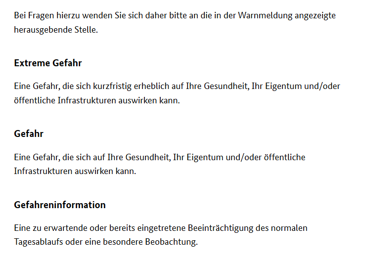

# CellBroadcast am 01.10.2025 in München zum Oktoberfest

Am 01.10.2025 um 11:04 wurde in München eine CellBroadcast Meldung aufgrund einer diffusen Bombendrohung gegen das Oktoberfest ausgelöst. Das Oktoberfest war zu diesem Zeitpunkt bereits geschlossen bzw. an diesem Tag garnicht erst eröffnet worden, da die Bedrohungslage schon in den frühen Morgenstunden betand.

Medieninformationen hierzu:
- [BR24: Großer Brandeinsatz und zeitweise Wiesn-Sperrung: Was wir wissen
](https://www.br.de/nachrichten/bayern/grosser-brandeinsatz-und-zeitweise-wiesn-sperrung-was-wir-wissen,UyNeYtd)
- [BR24: Handy-Alarm zur Wiesn-Schließung: "Extreme Gefahr", viele Fragen](https://www.br.de/nachrichten/bayern/extreme-gefahr-wirbel-um-handy-alarm-wegen-wiesn-schliessung,UyO5gh4)
- [BR24: Nach Oktoberfest-Sperrung: Herrmann kritisiert Handy-Warnung](https://www.br.de/nachrichten/bayern/nach-oktoberfest-sperrung-herrmann-kritisiert-handy-warnung,UyT9eET)

## Die Meldung
Die Meldung erfolgte als DE-Alert Level 2 "Extreme Gefahr" via Message ID 4372 (de) und 4385 (en) in der Region München mit folgendem Wortlaut:

```
⚠️ Extreme Gefahr

GEFAHRENMITTEILUNG, MITTEL Mi. 01.10.2025 - 11:04 Uhr - Achtung! Amtliche Warnmeldung - für München - Warnung - Informieren Sie sich in bekannten Warnmedien. - Weitere Infos auf https://warnung.bund.de/m/UC4QE9kVs6gi - Herausgegeben von: Integrierte Leitstelle München
```
```
⚠️ Extreme threat

DANGER, MEDIUM Wed 2025/10/01 - 11:04 am - Attention! Public safety alert - for München - Alert - Check the media for warning information. - Further information: https://warnung.bund.de/m/UC4QE9kVs6gi - Published by: Integrierte Leitstelle München
```


## Kritik

Vorab: Den Einsatz von CellBroadcast als Warnmittel will ich hier ausdrücklich gutheißen. Insbesondere aufgrund des Oktoberfests befanden sich unzählige ausländische Touristen in der Stadt und Umgebung, die sicher keine Ahnung haben was NINA oder KatWarn ist und vermutlich auch keine lokalen Medien verfolgen.

### Wortlaut der Meldung
Die Meldung enthält leider weder sinnvolle Handlunksinformationen noch Informationen zur Art der Gefahr. Der alleinige Verweis auf Medien bzw. den Link für weitere Informationen ist keinesfalls hinreichend. Grade im Kontext der vielen ausländischen Touristen ist z.B. zu beachten dass nicht jeder Datenroaming hat und den Link daher erst im Hotel oder anderswo mit W-LAN aufrufen kann. Ausserdem muss ja auch mal damit gerechnet werden dass die Website nicht erreichbar ist oder die lokale Internetinfrastruktur nicht mehr funktioniert.

Zusätzlich zur fehlenden Information sind mehr als die Hälfte der Nachricht sinnfreie Metadaten und Impressum.

`GEFAHRENMITTEILUNG, MITTEL Mi. 01.10.2025 - 11:04 Uhr - Achtung! Amtliche Warnmeldung - für München - Warnung` enthält vier mal den Hinweis dass es sich um eine "Warnmeldung" handelt. Die Angabe `MITTEL` ist ohne Kontext nicht einzuordnen und ordnet `Extreme Gefahr` auch nicht grade sinnvoll ein.
Zeitpunkt kann man machen, muss man nicht. Wann die Meldung ausgelöst wurde ist für den Nutzer egal - die Meldung kommt ja nur aufs Handy wenn sie relevant ist. Im Nachrichtenverlauf kann man auch genau sehen wann, wenn man sie später aufruft.

Ohne grundlegende Formatierung durch Umbrüche ist die Meldung auch schwer zu lesen und überblicken.

Wenn man schon meint unnötig viel Kopf- und Fußzeilen zu verwenden, sollte man diese zumindest optisch absetzen!

### Link
Der [Link zur Warnmeldung](https://warnung.bund.de/m/UC4QE9kVs6gi) ist bereits ab ~16 Uhr kaputt - vermutlich weil dann die Meldung aufgehoben wurde. Das ist natürlich ein Problem für diejenigen die die Meldung erst um ~16 Uhr zur Kenntnis genommen haben, z.B. weil sie zuvor in Arbeitsklamotten steckten und das Handy im Schrank war.
Die öffnen dann die inhaltsleere Meldung und erhalten nur einen defekten Ladebildschirm und wissen nun nicht, ob sie besser an ihrem Ort bleiben sollen oder die arbeit verlassen sollen. Sie wissen überhaupt nichts. Das ist inakzeptabel. 


### Warnstufe
Die Stufe "Extreme Gefahr" wird von einigen in dieser Situation als unverhältnismäßig gesehen. Teilweise rechtfertigen Medien das auch damit, dass das eben technisch so bedingt sei. Es ist kompliziert:

Das [Konzept des BBK](https://www.bbk.bund.de/DE/Warnung-Vorsorge/Warn-App-NINA/Funktion-Inhalt/Warnmeldungen/_documents/dossier_warnmeldungen-3.html?nn=20098#vt-sprg-1) kennt drei Warnstufen:

```
Extreme Gefahr
Eine Gefahr, die sich kurzfristig erheblich auf Ihre Gesundheit, Ihr Eigentum und/oder öffentliche Infrastrukturen auswirken kann.

Gefahr
Eine Gefahr, die sich auf Ihre Gesundheit, Ihr Eigentum und/oder öffentliche Infrastrukturen auswirken kann.

Gefahreninformation
Eine zu erwartende oder bereits eingetretene Beeinträchtigung des normalen Tagesablaufs oder eine besondere Beobachtung.
```

DE-Alert hat vier relevante Warnstufen:
```
DE-Alert Level 1: Notfallalarm
DE-Alert Level 2: Extreme Gefahr
DE-Alert Level 3: Erhebliche Gefahr
DE-Alert Level 4: Gefahreninformation
```
Da das BBK bzw. das System MoWaS aber nur die drei Stufen verwendet, wird DE-Alert Level 3 nicht verwendet.

Die Abbildung von MoWaS Warnstufe auf DE-Alert Level gibt [TR-DE-Alert 1.1](https://www.bundesnetzagentur.de/SharedDocs/Downloads/DE/Sachgebiete/Telekommunikation/Unternehmen_Institutionen/Anbieterpflichten/OeffentlicheSicherheit/DEAlert/Downlaod_TR-DE-Alert_1.1_Final.pdf) in 8.26, und die Bezeichnung der Meldestufen in Anhang I4 vor.




Dadurch ergibt sich folgende unglückliche Abbildung:

| MoWaS / NINA Warnstufe | DE-Alert Warnstufe  |
| ---------------------- | ------------------- |
| Extreme Gefahr         | Notfallalarm        |
| Gefahr                 | Extreme Gefahr      |
| Gefahreninformation    | Gefahreninformation |

Während die Leitstelle in MoWaS also grade nicht "Extreme Gefahr" ausgewählt hat, sondern die mittlere Stufe "Gefahr", wurde via DE-Alert "Extreme Gefahr" ausgelöst.

Das ist unglücklich und letztendlich auf die Vorgaben des BBK selbst zurückzuführen. Es wäre hier vielleicht dringend zu überdenken, die Namen der Warnstufen in allen Systemen zu vereinheitlichen!

Im konkreten Fall hätte ggf. auch "Gefahreninformation" als Stufe ausgereicht.

Letztendlich ist das aber auch nur ein einziges Wort das hier nur deshalb einen so großen Unterschied macht, weil die ganze restliche Meldung inhaltsfrei war. Bei einer gut gestalteten Warnmeldung wäre es IMHO recht egal ob nun "Gefahreninformation" oder "Gefahr" oder "Exreme Gefahr" drüber steht.

### 4G, 2G, Technisches
Zufällig hatte ich selbst drei Smartphones in den 4G Netzen der Telekom, Vodafone und Telefónica o2, sowie zwei Smartphones im 2G Netz der Telekom und Telefónica o2 aktiv. Alle diese Geräte unterstützen EU-Alert Level 2, was ich auch am Warntag regelmäßig bestätige.

Interessanter weise haben meine beiden Geräte im 2G Netz die Warung nicht erhalten. Da sich alle diese Geräte bei mir zuhause befanden, wärend ich dagegen ganztags in der Arbeit war, konnte ich während der Auslösung nichts weiter testen oder überprüfen.

Auch nicht unrelevant ist, dass mir bisher bei jedem Warntag (und das ist hier im Repo auch dokumentiert) aufgefallen ist, dass Vodafone und Telekom keine Zeilenumbrüche in den Nachrichten übermitteln. Selbst wenn also eine bessere Formatierung erfolgt wäre, käme diese nur bei o2 Kunden an.

### Fazit: Was kann verbessert werden?
- Ruhig früher auslösen - afaik war dies der erste Einsatz des Systems in München überhaupt
- Das BBK sollte die Kategorien der Warnmeldungen in allen Systemen angleichen
- Meldungen sollten konkrete Inhalte und grundlegende Formatierung enthalten, weniger (technische) Metainformationen

Vorschlag:
```
⚠️ Gefahreninformation

Oktoberfest heute aufgrund potentieller Bombendrohung geschlossen! Meiden Sie den Bereich der Theresienwiese. Sehen Sie von einer Anreise ab. Beachten Sie lokale Medien.

Weitere Informationen:
https://warnung.bund.de/m/UC4QE9kVs6gi

Integrierte Leitstelle München, 01.10.2025 08:00
```